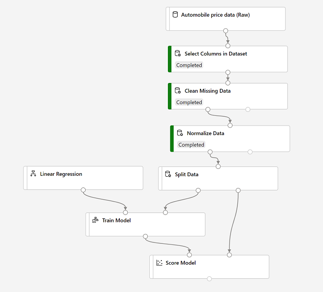

# Azure AI Fundamentals Notes

## Get started with artificial intelligence on Azure

Azure Machine Learning service is a cloud-based platform for creating, managing, and publishing machine learning models:

- Automated machine learning: quickly create an effective machine learning model from data
- Azure Machine Learning designer: A graphical interface enabling no-code development
- Data and compute management: Cloud-based data storage and compute resources
- Pipelines: define pipelines to orchestrate model training, deployment, and management tasks

### Anomaly detection

In Microsoft Azure, the Anomaly Detector service provides an application programming interface (API) that developers can use to create anomaly detection solutions.

### Computer Vision models and capabilities

- Image classification involves training a machine learning model to classify images based on their contents
- Object detection machine learning models are trained to classify individual objects within an image, and identify their location with a bounding box
- Semantic segmentation is an advanced machine learning technique in which individual pixels in the image are classified according to the object to which they belong
- Image analysis extract information from images, including "tags" that could help catalog the image or even descriptive captions that summarize the scene shown in the image
- Face detection is a specialized form of object detection that locates human faces in an image
- Optical character recognition is a technique used to detect and read text in images

### Understand natural language processing

- Analyze and interpret text in documents, email messages, and other sources
- Interpret spoken language, and synthesize speech responses
- Automatically translate spoken or written phrases between languages
- Interpret commands and determine appropriate actions

### Understand conversational AI

Bots can be the basis of AI solutions for:

- Customer support for products or services
- Reservation systems for restaurants, airlines, cinemas, and other appointment based businesses
- Health care consultations and self-diagnosis
- Home automation and personal digital assistants

At Microsoft, AI software development is guided by a set of six principles, designed to ensure that AI applications provide amazing solutions to difficult problems without any unintended negative consequences:

- Fairness
- Reliability and safety
- Privacy and security
- Inclusiveness
- Transparency
- Accountability

## Use visual tools to create machine learning models with Azure Machine Learning

### Azure Machine Learning

Azure Machine Learning is a cloud service that you can use to train and manage machine learning models. It includes a wide range of features and capabilities that help data scientists prepare data, train models, publish predictive services, and monitor their usage. Most importantly, it helps data scientists increase their efficiency by automating many of the time-consuming tasks associated with training models; and it enables them to use cloud-based compute resources that scale effectively to handle large volumes of data while incurring costs only when actually used.

> Create a workspace:
>
> - Sign into the Azure portal
> - Create a resource, search for Machine Learning
> - Subscription: Your Azure subscription
> - Resource group: Create or select a resource group
> - Workspace name: Enter a unique name for your workspace
> - Region: Select the geographical region closest to you

 There are four kinds of compute resource you can create (In Azure Machine Learning studio, view the Compute page -under Manage-):

- **Compute Instances**: Development workstations that data scientists can use to work with data and models
- **Compute Clusters**: Scalable clusters of virtual machines for on-demand processing of experiment code
- **Inference Clusters**: Deployment targets for predictive services that use your trained models
- **Attached Compute**: Links to existing Azure compute resources, such as Virtual Machines or Azure Databricks clusters.

> Create compute targets:
> On the Compute Instances tab, add a new compute instance
>
> Create compute clusters:
> Compute Clusters tab, add a new compute cluster

### Create a dataset

In Azure Machine Learning, data for model training and other operations is usually encapsulated in an object called a dataset.

> Datasets:
> Create a new dataset from local files

### Run an automated machine learning experiment

In Azure Machine Learning, operations that you run are called experiments. Follow the steps below to run an experiment that uses automated machine learning to train a regression model.

> Automated ML page:
> Create a new Automated ML run

### Deploy a model as a service

After you've used automated machine learning to train some models, you can deploy the best performing model as a service for client applications to use. you can deploy a service as an Azure Container Instances (ACI) or to an Azure Kubernetes Service (AKS) cluster. For production scenarios, an AKS deployment is recommended, for which you must create an inference cluster compute target.

### Clean-up

The web service you created is hosted in an Azure Container Instance. If you don't intend to experiment with it further, you should delete the endpoint to avoid accruing unnecessary Azure usage. You should also stop the training cluster and compute instance resources until you need them again.

- In Azure Machine Learning studio, on the Endpoints tab, then select Delete (🗑) and confirm that you want to delete the endpoint
- On the Compute page, on the Compute Instances tab, select your compute instance and then select Stop

## Create a Regression Model with Azure Machine Learning designer

You can use Microsoft Azure Machine Learning designer to create regression models by using a drag and drop visual interface, without needing to write any code. To use the Azure Machine Learning designer, you create a pipeline that you will use to train a machine learning model. This pipeline starts with the dataset from which you want to train the model.

> Data Transformation section contains a wide range of modules you can use to transform data before model training
>
> - Select Submit, and run the pipeline
> - The dataset is now prepared for model training
> - Select the completed Normalize Data module, and in its Settings pane on the right, on the Outputs + logs tab
> - Select the Visualize icon for the Transformed dataset

### Create and run a training pipeline

> - In the Data Transformations section, drag a Split Data module onto the canvas under the Normalize Data module
> - In the Model Training section, drag a Train Model module to the canvas
> - In the Machine Learning Algorithms section, and under Regression, drag a Linear Regression module to the canvas
> - In  the Model Scoring & Evaluation section and drag a Score Model module to the canvas
> - Select Submit, and run the pipeline

*Credits to Microsoft: <https://docs.microsoft.com/en-us/learn/modules/create-regression-model-azure-machine-learning-designer/evaluate-model>*

### Add an Evaluate Model module

In the Model Scoring & Evaluation section, drag an Evaluate Model module to the canvas, under the Score Model module, and connect the output of the Score Model module to the Scored dataset. These include the following regression performance metrics:

- Mean Absolute Error (MAE): The average difference between predicted values and true values
- Root Mean Squared Error (RMSE): The square root of the mean squared difference between predicted and true values
- Relative Squared Error (RSE): A relative metric between 0 and 1 based on the square of the differences between predicted and true values
- Relative Absolute Error (RAE): A relative metric between 0 and 1 based on the absolute differences between predicted and true values
- Coefficient of Determination (R2): This metric is more commonly referred to as R-Squared, and summarizes how much of the variance between predicted and true values is explained by the model

### Create and run an inference pipeline

> - In Azure Machine Learning Studio, click the Designer page to view all of the pipelines you have created
> - In the Create inference pipeline drop-down list, click Real-time inference pipeline